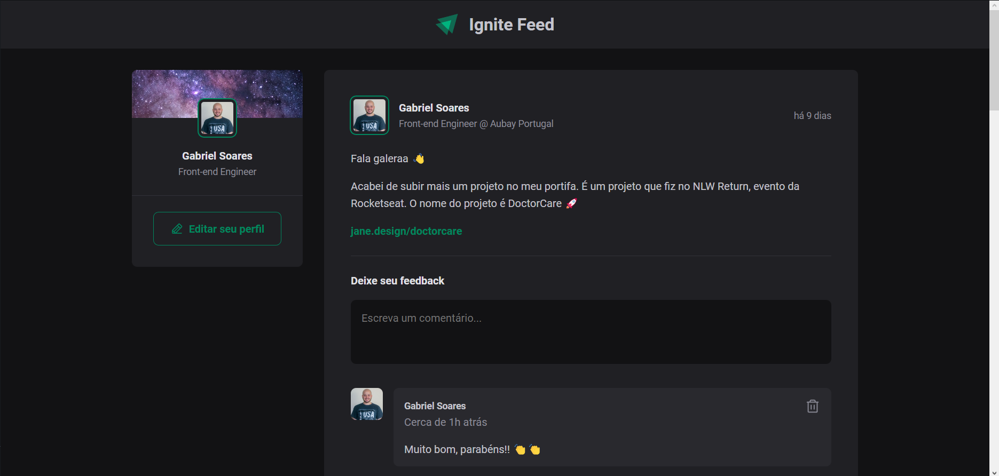
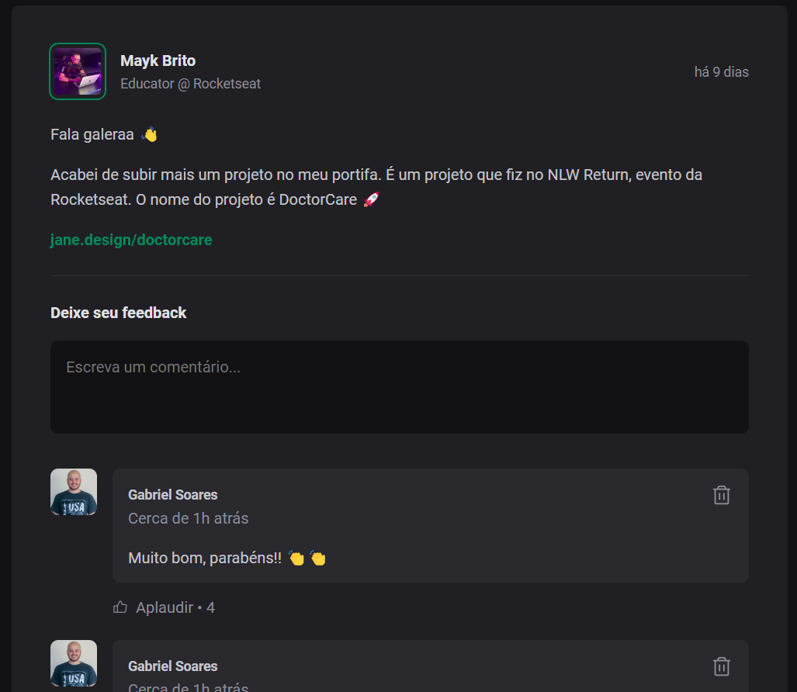

# 
Ignite Feed

Ignite Feed is an application created at Ignite Bootcamp (Rocketseat) to understand better the first concepts around ReactJS.  

## Layout
We have access to a layout in Figma so that we can follow the criteria presented with the course.  
[Layout on Figma](https://www.figma.com/community/file/1113573231685349036)

After the development of the entire module, the following result was obtained:

 

## Concepts
The concepts that we worked on this modules, it's basics from Front-end, React and TypeScript.

- Bundlers & Compilers
- CSS Modules
- Responsiveness
- Declarative/Imperative Programming

 

- How to create a React project using Vite
- Components in React
- Properties in React
- Immutability in React
- Iterating in React
- Keys (key={...})
- State (useState)
- Working with forms
- Closures in React

 

- Using TypeScript
- Interfaces
- Extending Interfaces from HTML Attributes

## Next steps

After this first module we could make so much more for this app, like use Context API and a Mock Server maybe to give more life for the app (in development mode).

For now, this is only to practice a little bit of React and its fundaments and other tools.
